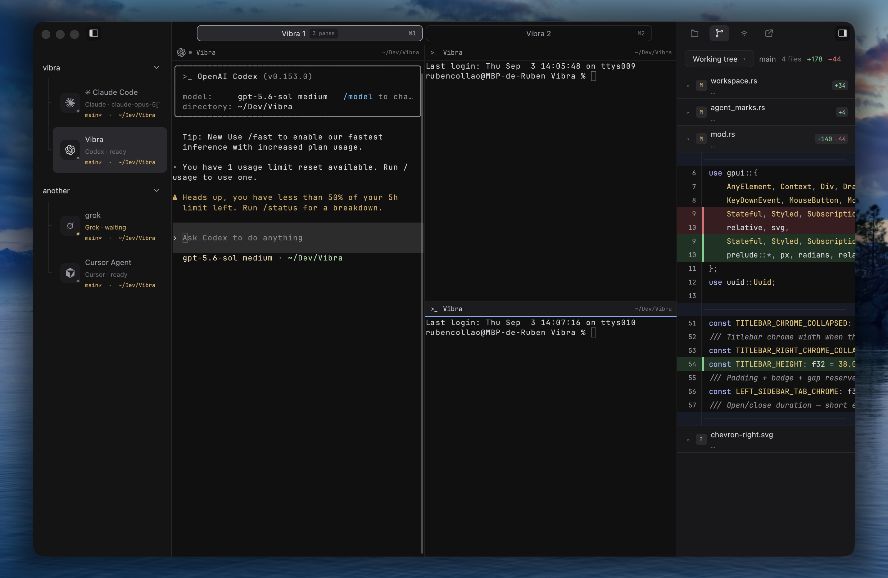

# Vibra

Workspace de desarrollo nativo para macOS, escrito en Rust con GPUI. Combina
terminales persistentes, proyectos, archivos, edición de texto, diff de Git e
integración local para agentes en una sola ventana enfocada.



La rama GPUI reemplaza la implementación SwiftUI/AppKit que llegó hasta Vibra
0.2.7. El motor de terminal actual es `libghostty-vt`, integrado directamente en Rust. El historial, identidad de aplicación y canal de distribución
continúan en este mismo repositorio.

## Estado de la migración

A partir de **Vibra 0.3.0**, el runtime oficial es GPUI (Rust + Metal). La
última build Swift es 0.2.7.

La app empaqueta de nuevo **Sparkle** con el mismo feed EdDSA, de modo que
instalaciones previas en 0.2.7 pueden actualizarse al canal estable:

```text
https://rubenrca.github.io/Vibra/appcast.xml
```

La identidad `app.vibra.Vibra` y la migración de `workspace.json` se mantienen.

## Funciones principales

### Proyectos, tabs y panes

- proyectos asociados a carpetas, cada uno con su fila de tabs persistente; se agregan desde la sidebar o con `⇧⌘O`;
- navegación global con Search, Inbox, Notes, Automations y Settings (ver [Inbox, Notes y Automations](#inbox-notes-y-automations)); cada proyecto se muestra con un avatar de su inicial en su color y un punto con el estado más urgente de sus agentes (pide permiso, espera, trabajando) y cuántos corren, que al pasar el cursor se vuelve el botón de nuevo tab;
- proyectos renombrables, reordenables y fijables desde su menú contextual; cerrar el último tab conserva el proyecto;
- `⌘T` o `⌘N`, el `＋` de la barra de tabs o el de cada proyecto abren un tab en la carpeta del proyecto; los panes también parten desde esa raíz. Las versiones anteriores permitían varias sesiones ocultas por proyecto: al abrir el workspace sus tabs se unen a la fila del proyecto, para que ninguna terminal quede fuera de alcance;
- los tabs de un proyecto comparten sus archivos y rama Git; Files, Git y búsqueda conservan la raíz del proyecto aunque una terminal haga `cd`;
- terminales divididas recursivamente en cuatro direcciones; con más de un pane, cada uno tiene una cabecera con los seis puntos para arrastrarlo y reordenarlo, su agente y título, un botón para agrandarlo al tab completo o restaurarlo (también con doble clic en la cabecera o `⇧⌘↵`) y otro para cerrarlo;
- reordenar tabs, panes y proyectos arrastrándolos; saltar a un tab con `⌘1`–`⌘8` y al último con `⌘9` (la revisión abierta cuenta como un tab más, después de los de terminal);
- navegación **atrás/adelante** (`⌃⌘←` / `⌃⌘→` o las flechas de la barra de título) entre tabs, proyectos y la revisión, sin importar cómo se llegó a cada lugar; `⌃⌘[` / `⌃⌘]` pasan al proyecto anterior o siguiente;
- barra de estado inferior con la rama del proyecto (cambios sin commit, ↑ahead ↓behind), los agentes activos y los eventos sin leer del Inbox; cada elemento abre Changes o el Inbox;
- foco geométrico, resize por teclado o arrastrando, reparto equitativo y zoom;
- panel Workspace a la derecha con Explorer y Changes; elegir un proyecto no lo abre ni lo cambia, queda como lo dejaste;
- menús contextuales en proyectos y panes (renombrar, cerrar, dividir, zoom);
- transparencia base del 6 % sobre el desenfoque nativo de macOS en el fondo, las sidebars, la barra superior y el terminal, manteniendo opacos el texto y los iconos;
- command palette (`⇧⌘P`), apertura rápida de archivos (`⌘P`) y Settings modal (`⌘,`);
- temas de aplicación (familias claras/oscuras y paletas de terminal) más YAML de Warp o Ghostty en `~/.vibra/themes`.

### Inbox, Notes y Automations

Vibra adopta la organización de una GUI de agentes, pero la superficie de trabajo
sigue siendo la terminal: cualquier CLI funciona sin integraciones específicas.

- **Inbox** reúne los agentes activos de todos los proyectos (con su estado:
  trabajando, espera tu respuesta, pide permiso) y el historial de eventos: un
  agente que terminó, pidió permiso o espera respuesta en una terminal que no
  estabas mirando, y las automatizaciones que se iniciaron. La navegación muestra
  el número de eventos sin leer; al elegir uno se abre su terminal y se marca como
  leído, igual que al enfocar ese pane. El historial vive mientras la app está
  abierta;
- **Notes** guarda notas de texto asociadas a un proyecto (el chip del proyecto
  cambia la asociación). El título sale de la primera línea. **Pegar en la
  terminal** pega la nota en la terminal activa de su proyecto sin enviarla, para
  editarla ahí antes de pulsar Enter. Las notas vacías se descartan solas;
- **Automations** guarda comandos con nombre, proyecto y horario: manual, cada
  hora, todos los días o de lunes a viernes. Cada ejecución abre un tab nuevo
  en el proyecto, con el nombre de la automatización, y escribe el comando en su
  shell, así que la salida queda visible y el tab sigue disponible. Las
  ejecuciones programadas no cambian el tab que estás mirando y avisan en el
  Inbox. Solo corren mientras Vibra está abierta: una hora perdida por más de
  10 minutos (Mac dormido o app cerrada) se omite en lugar de ejecutarse tarde.
  Al quitar su proyecto quedan pausadas. Se pueden pausar, editar y lanzar desde la paleta (`Automatización: Ejecutar …`).

Notas y automatizaciones se guardan en
`~/Library/Application Support/Vibra/library.json`, junto a `settings.json`.

### Terminal

- PTY nativo y emulación ANSI con `libghostty-vt`;
- render GPUI/Metal, truecolor, estilos, cursores, scrollback e IME;
- teclado xterm y Kitty, mouse SGR, bracketed paste y alternate screen;
- pegado estilo Warp (`⌘V`): texto con bracketed paste; con imagen en el clipboard y un agente CLI en foco, se envía Ctrl+V para adjuntar capturas;
- selección, búsqueda, enlaces OSC 8 y clipboard OSC 52 protegido;
- JetBrains Mono Variable incluida en la aplicación.

### Files y Git

- panel derecho unificado con las vistas `Explorer` y `Changes`;
- árbol de archivos confinado al proyecto, con iconos SVG de carpetas/archivos y guías de indentación; su barra crea archivos y carpetas (admite rutas como `src/lib.rs`, siempre dentro del proyecto y sin sobrescribir), colapsa todo y actualiza;
- árbol de archivos que conserva el terminal como superficie central y enfoca los archivos modificados directamente en Git;
- panel Git con cuatro vistas: working tree, cambios de la rama frente a la base por defecto, `Latest turn` (lo que cambió desde que un agente empezó su último turno en el repositorio) e historial de commits con grafo de lanes;
- en `History`, un clic en un commit abre sus archivos y diffs, con el primer archivo desplegado y `Back to history` para volver al listado; muestra solo lo guardado en ese commit y compara los merges con su primer padre;
- `Branch changes` permite elegir `Base` y `Compare` entre ramas locales y referencias remotas del último fetch, sin cambiar de rama; dos ramas comparan sus versiones guardadas, y `Working tree` incluye cambios sin commit. `Auto` + `Working tree` conserva la comparación desde el ancestro común;
- Changes sigue el esquema de un IDE: cabecera con la rama y un menú `…` (vistas Working tree, Branch changes, Latest turn e History, más Fetch, Pull, Push y Refresh), caja de mensaje con **Commit** (`⌘↩`) y un desplegable para *Commit y push* o *Modificar último commit*, **Create PR**, la lista de archivos agrupada en Changes/Staged Changes y, abajo, el **Graph** plegable con los commits, sus ramas y el grafo de lanes;
- cada archivo de Changes muestra al pasar el cursor `+` para pasarlo a stage o `−` para sacarlo; los grupos Changes y Staged Changes tienen lo mismo para todos sus archivos;
- ✨ en la caja de mensaje redacta el commit con el agente CLI instalado (Claude Code, Gemini CLI o Codex, en ese orden), usando la shell de login del usuario. Recibe el patch de lo que se va a confirmar (hasta 48 KiB) y los últimos asuntos para imitar el estilo; el mensaje queda editable antes de confirmar;
- Commit confirma lo que esté en stage o, si no hay nada, todos los cambios (como el *smart commit* de VS Code). Push, pull (`--ff-only`) y fetch corren en segundo plano sin pedir credenciales por terminal; si fallan, el panel muestra el error. Un primer push crea el upstream en `origin`;
- Create PR abre un tab nuevo en el proyecto con `gh pr create`, así el flujo interactivo de GitHub CLI queda en una terminal normal;
- al elegir un archivo o un commit del grafo, la revisión se abre como **un tab más** que ocupa el centro, igual que los tabs de terminal; su título y su cierre están en el tab. El botón de split de su barra la muestra junto a la terminal, con un divisor que se arrastra (la proporción se recuerda) y una cabecera para volver al tab completo o cerrarla; en ese modo se resaltan ambos tabs, porque los dos están en pantalla. Elegir un tab de terminal, cambiar entre Explorer y Changes o ir al Inbox deja la revisión abierta; `⌘W` sobre ella la cierra sin cerrar el proceso de la terminal. Un commit abierto desde el grafo vuelve a Changes al cerrarlo; los archivos de Changes usan el mismo ícono por tipo que el Explorer;
- diffs de solo lectura en una sola lista virtualizada: archivos plegables con animación, la cabecera del archivo actual fija arriba, numeración única en Unified (anterior en eliminaciones y nueva en contexto/adiciones), las líneas sin cambios entre bloques plegadas en barras «N unmodified lines» que se abren de 20 en 20 hacia arriba o abajo (o completas con un clic), botones para expandir o colapsar todos los archivos y resaltado de sintaxis con el archivo completo como contexto (Rust, JS/TS, Python, Swift, Go, shell y configs comunes);
- vista unificada o lado a lado y ajuste de líneas largas, recordados entre sesiones; sin ajuste, el scroll horizontal mueve solo el código, sincronizado entre archivos y columnas; el tamaño del texto del diff se ajusta aparte en Ajustes › Apariencia;
- comentarios de revisión por línea (botón `+` al pasar el cursor) que se pegan como un solo prompt en la terminal del agente, sin enviarlo, para editarlo antes de pulsar Enter;
- el resto de mutaciones Git (stage parcial, ramas, rebase, stash) se hacen desde la terminal integrada.

### Agentes y seguimiento

- detección de Codex, Claude, Gemini, Goose, Grok, OpenCode, Cursor, Aider, Amp y Pi;
- estados de actividad en vivo para los agentes que se ejecutan dentro de una terminal de Vibra;
- avisos de sistema cuando un agente termina o pide permiso fuera del pane visible;
- identidad resuelta por proceso foreground, sesión, título y texto reciente;
- nombres personalizados para panes desde su menú contextual;
- hooks estructurados de Claude y Codex para estados de trabajo, espera, permisos y fin de sesión;
- títulos automáticos a partir de la primera línea del mensaje enviado a Claude o Codex, con hooks instalados: se acortan localmente, se guardan por pane y respetan los nombres manuales de la sidebar; respuestas como «sí» o «continúa» conservan el título anterior;
- socket Unix local protegido por capacidades UUID;

La CLI de Vibra no orquesta agentes ni layouts desde una terminal: no crea panes o
tabs, no lanza agentes en otras sesiones y no envía prompts a otros procesos. Los
agentes se ejecutan en la terminal (a mano o con una automatización que tú
configuraste, siempre en un tab visible) y Vibra conserva su detección,
estado y notificaciones.

La detección automática está siempre activa. Para obtener estados más precisos
en Claude y Codex, instala sus hooks opcionales desde **Settings → Actividad de
agentes CLI → Instalar hooks** o mediante la CLI:

```bash
Vibra agent setup
Vibra agent status
Vibra agent uninstall codex
```

El instalador añade únicamente los handlers de Vibra a `~/.claude/settings.json`
y `~/.codex/hooks.json`, guarda scripts en `~/.vibra/agent-hooks/` y conserva los
hooks existentes. Los scripts no hacen nada fuera de un pane de Vibra y los eventos
se procesan en orden para evitar estados atrasados. Después de instalar el hook de
Codex, ábrelo una vez y apruébalo en `/hooks`.

Claude y Codex tienen seguimiento estructurado mediante esos hooks. En Gemini,
Goose, Grok, OpenCode, Cursor, Aider, Amp y Pi, Vibra sólo infiere la actividad
desde el proceso y el texto visible.

## Requisitos

- macOS 14 o posterior;
- Xcode;
- Rust 1.96.

El proyecto incluye GPUI 0.2.2 en `third_party/gpui`, con una corrección de la
composición alfa de Metal para conservar la transparencia entre capas. Cargo
utiliza esta copia mediante `[patch.crates-io]`; el origen y el cambio están
documentados en [VIBRA_PATCHES.md](third_party/gpui/VIBRA_PATCHES.md).

## Ejecutar durante desarrollo

La [guía de arquitectura](docs/architecture.md) describe las responsabilidades del
workspace y los contratos de navegación, aislamiento por proyecto y guardado.

```bash
./Scripts/fetch_ghostty.sh
cargo run
cargo run -- /ruta/al/proyecto
```

Las rutas relativas se resuelven contra el directorio actual antes de guardarse.
Si una carpeta se llama `agent`, usa `./agent` para distinguirla del subcomando
de configuración de hooks.

Para evaluar fluidez y rendimiento, usa `cargo run --release`; `cargo run` compila
sin optimizaciones y añade coste al renderizado.

La preparación de Ghostty descarga Zig y compila la biblioteca dentro de `.build/`,
sin instalaciones globales. Véase [la integración Ghostty](docs/ghostty.md).

Cada cambio requiere cerrar la aplicación y ejecutar nuevamente `cargo run`.

Verificar formato, tests, Clippy, plist y scripts:

```bash
./Scripts/verify.sh
```

## Crear Vibra.app

Bundle de desarrollo firmado ad-hoc:

```bash
./Scripts/package_app.sh debug --sign -
open dist/Vibra.app
```

Bundle universal, DMG, firma Developer ID y notarización:

```bash
./Scripts/package_app.sh release --universal --dmg --notarize --sign "$VIBRA_SIGNING_IDENTITY"
```

La notarización usa `APPLE_KEYCHAIN_PROFILE`, o `APPLE_ID`, `APPLE_TEAM_ID` y
`APPLE_APP_SPECIFIC_PASSWORD`. La identidad puede definirse con
`VIBRA_SIGNING_IDENTITY` o `--sign`; para notarizar se exige elegirla explícitamente.
El release normal notariza solo el DMG,
que es el archivo distribuido. La espera está limitada a dos horas por defecto;
si Apple demora más, conserva la solicitud y el ID queda en
`dist/notarization/Vibra.dmg.submission-id` para consultarlo después. El script
respeta `CARGO_TARGET_DIR` si se usa un directorio de compilación distinto.

## Releases

Requiere un árbol limpio, `Cargo.toml` y una sección en `CHANGELOG.md` con la
misma versión, más Sparkle descargado con `./Scripts/fetch_sparkle.sh`
(clave EdDSA en el llavero) y `VIBRA_SIGNING_IDENTITY` con el nombre completo
del certificado Developer ID de Vibra:

```bash
./Scripts/release.sh 0.3.29 --dry-run
./Scripts/release.sh 0.3.29
./Scripts/release.sh 0.3.29-beta.1 --prerelease
./Scripts/release.sh 0.3.29 --dry-run --no-notarize  # empaquetado local sin notarizar
./Scripts/release.sh 0.3.29 --resume-dmg    # valida y publica el DMG tras una espera interrumpida
```

Un release **estable** crea el DMG universal, firma con Developer ID, notariza
con Apple, firma el appcast, publica en GitHub
como Latest y actualiza `docs/appcast.xml`. Un **prerelease** no toca el feed
de Sparkle. Al reanudar, el script comprueba versión, build, commit de origen,
identidad de firma y ticket de notarización antes de publicar.

## Migración de datos

Vibra GPUI conserva la identidad `app.vibra.Vibra` y usa:

```text
~/Library/Application Support/Vibra/workspace.json
```

Antes de escribir un workspace creado por Swift, guarda una copia única en:

```text
~/Library/Application Support/Vibra/workspace.swift-v0.2.7.backup.json
```

Si no existe un workspace de Vibra, importa automáticamente el creado durante
el preview independiente de VibraGPUI. Las preferencias del preview también se
importan una sola vez.

El esquema de proyectos conserva las sesiones, nombres y layouts existentes. Los
espacios anteriores se convierten en proyectos; si reunían carpetas distintas o
estaban vacíos, muestran **Asociar carpeta…** para elegir su raíz. Las terminales
restauradas conservan sus directorios. Antes de migrar se guarda una copia única
en `workspace.pre-projects.backup.json`, junto a `workspace.json`.

## Atajos principales

| Atajo | Acción |
| --- | --- |
| `⇧⌘O` | Agregar proyecto desde una carpeta |
| `⌘T` o `⌘N` / `⌘W` | Nuevo tab en el proyecto / cerrar el pane, la revisión o la página abierta |
| `⌃⌘[` / `⌃⌘]` | Proyecto anterior / siguiente |
| `⌘1`–`⌘8` / `⌘9` | Ir al tab 1–8 / ir al último tab (incluye la revisión) |
| `⌃⌘←` / `⌃⌘→` | Atrás / adelante entre tabs, proyectos y la revisión |
| `⌘D` / `⇧⌘D` | Dividir a la derecha / abajo |
| `⌃⌥⌘` + flechas | Dividir en cualquier dirección |
| `⌥⌘` + flechas | Enfocar pane vecino |
| `⌘[` / `⌘]` | Pane anterior / siguiente |
| `⌃⌥` + flechas | Cambiar proporción del pane |
| `⌃⌥E` / `⇧⌘↵` | Igualar panes / agrandar o restaurar el pane |
| `⇧⌘P` / `⌘P` | Paleta de comandos / quick open |
| `⇧⌘E` | Abrir la carpeta activa en un IDE externo |
| `⌘,` | Abrir Settings (modal centrado) |
| `⌘B` | Mostrar u ocultar navegación global |
| `⌥⌘B` | Mostrar u ocultar panel Workspace |
| `⌘U` | Buscar actualizaciones (Sparkle) |
| `⌘V` | Pegar (bracketed paste; Ctrl+V con imagen en agentes CLI) |
| `⌘F`, `⌘G`, `⇧⌘G` | Buscar / siguiente / anterior en terminal |
| `⌘=`, `⌘-`, `⌘0` | Ajustar o restablecer fuente |
| `⌘K` | Limpiar pantalla y scrollback |

## Arquitectura

```text
GPUI views
   │
WorkspaceSnapshot + acciones de dominio
   ├── WorkspaceRepository ── JSON versionado y migración Swift
   ├── SettingsRepository  ── preferencias persistentes
   ├── TerminalPort        ── GhosttyTerminal (PTY + libghostty-vt)
   ├── FileSystemPort      ── filesystem local confinado
   ├── GitPort             ── status y diff mediante git CLI
   └── AutomationServer    ── socket Unix + capacidades por pane
```

La vista principal se organiza en `src/ui/workspace_view/`:

- `mod.rs`: coordinación del workspace, eventos y composición de la ventana.
- `titlebar.rs`: barra de título, pestañas de utilidad y menú de IDE.
- `navigation.rs`: navegación global y marco compartido de Inbox, Notes y Automations.
- `inbox.rs`: agentes activos, eventos sin leer y salto a su terminal.
- `tabs.rs`: el tab de la revisión, el split redimensionable y la navegación atrás/adelante.
- `status_bar.rs`: rama, agentes activos e Inbox en la barra inferior.
- `explorer.rs`: barra del Explorer para crear archivos y carpetas.
- `notes.rs`: lista, edición y pegado de notas.
- `automations_page.rs`: formulario, ejecución y programación de automatizaciones.
- `text_edit.rs`: edición por teclado de notas y formularios.
- `panes.rs`: layout de panes, tab bar y atajos de división.
- `projects.rs`: selector de carpetas, navegación y encabezados de proyectos.
- `palette.rs`: paleta de comandos y apertura rápida de archivos.
- `input.rs`: atajos globales y overlays de entrada.
- `drag.rs`: payloads y previews de arrastre.
- `settings.rs`: páginas de configuración y aplicación de preferencias.
- `files.rs`: recorrido del árbol de archivos, iconos e indicadores Git.
- `chrome.rs`: etiquetas, layout compartido y conversión de texto de la interfaz.
- `automation.rs`: resolución de presencia y estado de agentes.

## Licencia y reconocimientos

Vibra usa licencia MIT. Consulta [NOTICE.md](NOTICE.md) para dependencias y
reconocimientos.
